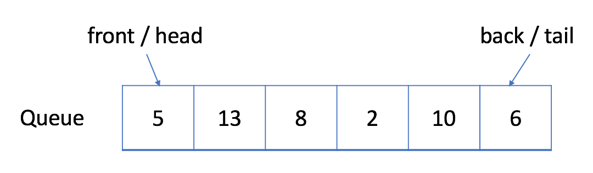

# Queue

In a FIFO data structure, the first element added to the queue will be processed first.

As shown in the picture above, the queue is a typical FIFO data stucture. The insert operation is also called enqueue and the new element is always added at the end of the queue. The delete operation is called dequeue. You are only allowed to remove the first element.

## Enqueue

Before

After

## Dequeue

Before

After

## Circule Queue / Ring Buffer

The circular queue is a linear data structure in which the operations are performed based on FIFO (First In First Out) principle and the last position is connected back to the first position to make a circle.

One of the benefits of the circular queue is that we can make use of the spaces in front of the queue. In a normal queue, once the queue becomes full, we cannot insert the next element even if there is a space in front of the queue. But using the circular queue, we can use the space to store new values.
