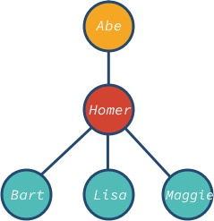

# Tree

A tree is a data structure where a node can have zero or more children. Each node contains a value. Like graphs, the connection between nodes is called edges. A tree is a type of graph, but not all graphs are trees.

These data structures are called “trees” because the data structure resembles a tree 🌳. It starts with a root node and branch off with its descendants, and finally, there are leaves.

A tree data structure can be defined recursively as a collection of nodes (starting at a root node), where each node is a data structure consisting of a value, together with a list of references to nodes (the "children"), with the constraints that no reference is duplicated, and none points to the root.

A tree is a nonlinear data structure, compared to arrays, linked lists, stacks and queues which are linear data structures. A tree can be empty with no nodes or a tree is a structure consisting of one node called the root and zero or one or more subtrees.

```
node simple-demo.js
```

The tree data structure is as follows



## Binary Tree

Trees nodes can have zero or more children. However, when a tree has at the most two children, then it’s called binary tree.
Full, Complete, and Perfect binary trees

Depending on how nodes are arranged in a binary tree, it can be full, complete and perfect:

- Full binary tree: each node has exactly 0 or 2 children (but never 1).
- Complete binary tree: when all levels except the last one are full with nodes.
- Perfect binary tree: when all the levels (including the last one) are full of nodes.

Look at these examples:

## Binary Search Tree

Similar to Tree, but it can only have two branches, e.g. left and right

```

```

# Terminologies


- The top-most node is called root.

- A node without children is called leaf node or terminal node.
- Height (h) of the tree is the distance (edge count) between the farthest leaf to the root.
  - A has a height of 3
  - I has a height of 0
- Depth or level of a node is the distance between the root and the node in question.
  - H has a depth of 2
  - B has a depth of 1

# Not tree

The following demonstrates data structures that are not trees.

```
A→B
C→D→E
```

1. Two non-connected parts. There is more than one root.

```
1-> 2, 3
2 -> 4
3 -> 4
```

2. undirected cycle 1->2->4, 1->3->4. 4 has more than one parent (inbound edge).

```
A->B->C->E->D->B
E-> D, F
```

3. cycle B→C→E→D→B. B has more than one parent (inbound edge).

```
A -> A
```

4. cycle A→A. A is the root but it also has a parent.
